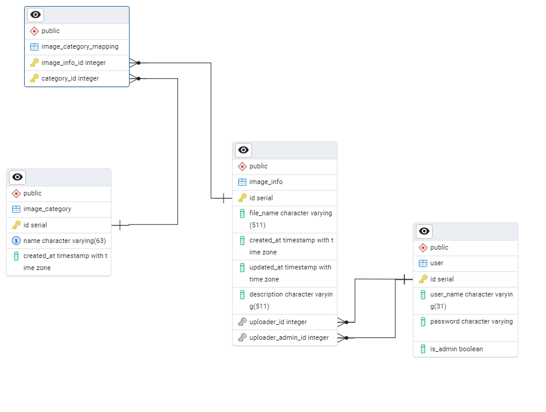

## 설치

설치를 위해선 Docker, docker-compose가 필요.

다음 두 커맨드를 실행하여 첫 빌드와 DB Schema 생성을 실행.
```shell
docker-compose build
docker-compose run --rm backend python -m image_hub.database.commands.create_db_schema
```

다음 커맨드를 실행하여 어플리케이션을 실행시킨다.
```shell
docker-compose up
```

이후는 다시 빌드가 필요하면 docker-compose 빌드 커맨드를 사용.
```shell
docker-compose build
```

## 어드민 유저 추가

아래 커맨드에서 `{유저 이름}`과 `{패스워드}`를 원하는 유저 이름과 패스워드로 교체해서 커맨드를 실행.
```shell
docker-compose run --rm backend python -m image_hub.auth.commands.create_admin --name={유저 이름} --password={패스워드}
```

## DB Schema 삭제와 제 생성
PostgreSQL을 사용하기 때문에 [image_hub/database/models.py](image_hub/database/models.py)에 존재하는 ORM 클래스를 수정한다면,
DB Schema를 지우고 다시 생성할 필요가 있음.

### Schema 생성 스크립트
[create_db_schema.py](image_hub/database/commands/create_db_schema.py)

docker-compose를 사용해 실행.
```shell
docker-compose build
docker-compose run --rm backend python -m image_hubF.database.commands.create_db_schema
```

### DB Schema 삭제 스크립트
[delete_db_schema.py](image_hub/database/commands/delete_db_schema.py)

docker-compose를 사용해 실행.
```shell
docker-compose build
docker-compose run --rm backend python -m image_hub.database.commands.delete_db_schema
```

## 샘플 데이터 추가

### 커맨드

```shell
docker-compose run --rm backend python -m image_hub.commands.create_sample_data
```

- `admin1`, `admin2`, ... `admin10` 아이디의 어드민 계정 10개를 생성함.

- `user1`, `user2`, ... `user10` 아이디의 일반 유저 계정 10개를 생성함.

- `CATEGORY_1`, `CATEGORY_2`, ... `CATEGORY_50`라는 이름의 50개의 카테고리를 생성함.

- 모든 유저의 패스워드는 `asdf`로 세팅되어 있고, 각 유저별로 해당 랜덤한 개수의 랜덤 이미지를 생성한다. (최소 1개)

### 주의점

샘플 데이터는 비어있는 DB에 실행되는 것을 전제로 만들어 졌기 때문에,
혹시 DB에 추가된 데이터가 있다면 중복된 유저 아이디나 카테고리 이름으로 인해 에러가 날 수가 있습니다. 

이경우 위의 DB Schema 삭제 스크립트를 실행 시켜서 기존의 데이터를 지우고 다시 DB Schema 생성 스크립트를 실행시킨 뒤에 
샘플 데이터 추가 커맨들르 실행하십시오.

## API 문서

`http://localhost:8000/docs` 주소에 Swagger 페이지가 있습니다.


## DB Schema

[ERD 파일](resources/db_schema.pgerd)



## Further Thoughts

현재 생략한 기능이나 추가를 생각해 볼 수도 있는 것들.

- DB 스키마를 삭제하고 다시 생성하는 방식으로만 Schema 수정을 실행하였기에 Schema 수정시 기존 데이터가 날아감.
  - SQLAlchemy 전용 마이그레이션 라이브러리인 alembic을 사용한 DB mirgation 관리
- 유닛테스트, 인터그레이션 테스트
  - pytest등을 사용한 유닛 테스트 도입과 테스트 전용 DB를 생성하여 integration 테스트를 추가해서 코드를 더 안정적으로 관리.
  - 시간 부족으로 생략.
- 어드민과 유저 테이블 분리
  - 현재 어드민과 유저가 같은 테이블을 공유하고 있지만, 어드민과 유저에게 필요한 정보가 후에 달라질 경우를 생각한다면 테이블을 분리를 생각해볼 필요가 있음.
- S3같은 클라우드 서비스를 이용한 이미지 관리
  - 현재 과제 요구 사항은 이미지를 서버에 직접 저장하는 것이었기에 사용안함.
  - 만약 S3를 사용하는것을 전제로 만들 었다면 Localstack등의 AWS 에뮬레이터 컨테이너 등을 사용하여 로컬에서 boto3를 사용해서 S3를 사용하는 방향으로 설계할 수도.
